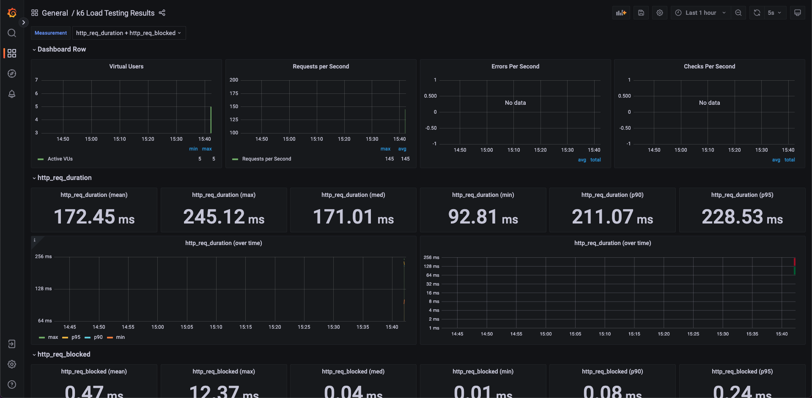

# Redis Grafana and K6

## Screenshot




## How to start

1. Run MariaDB and Redis
```
$ docker compose up mariadb redis
```

2. Run application on http://localhost:9000
```
$ go run main.go
```

3. Start InfluxDB and Grafana and go to grafana dashboard at http://localhost:3000
- Add influxdb for k6
- Add dashboard for k6
```
$ docker compose up influxdb grafana
```

4. Run Redis and K6 Load test
```
$ docker compose run --rm k6 run /scripts/test.js
```